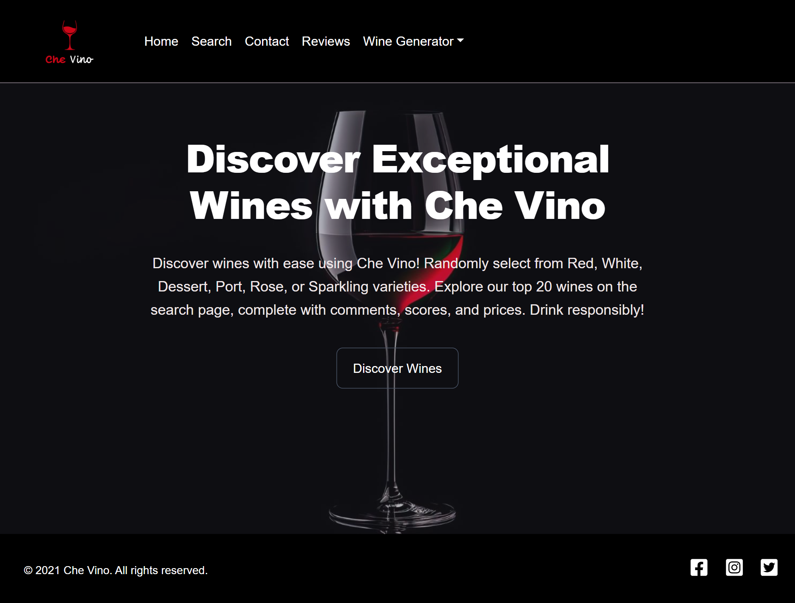
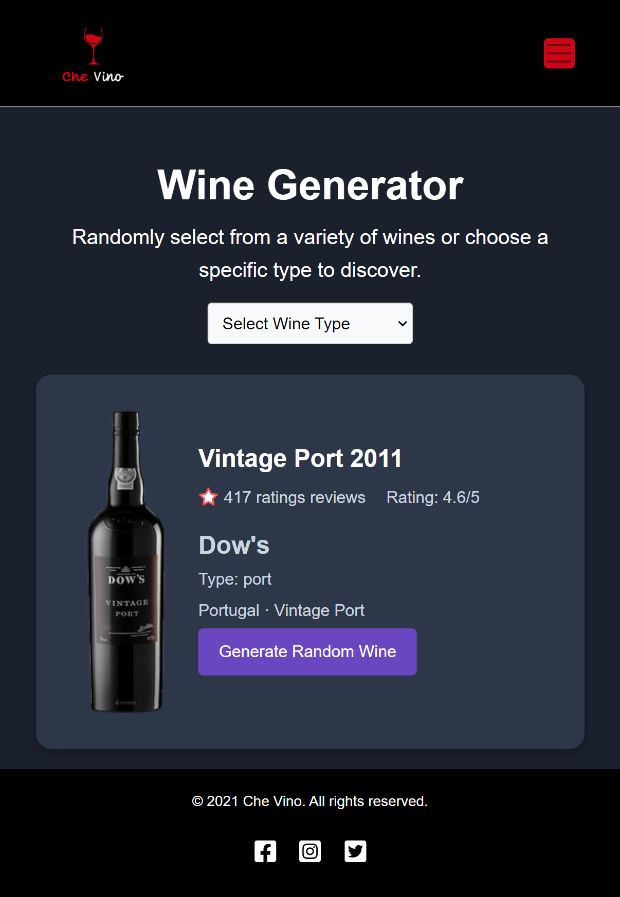

# Che Vino

For my capstone project I created a web application called Che Vino – translation from Italian: What Wine!

My idea came from the wine world can be overwhelming with all the many choices that it provides. There are hundreds of different varieties of wine and I am usually the one standing in the wine section unsure of what wine to choose.

Che Vino is designed to help the user discover new wines, read reviews, and check out wine scores. It helps take the guess work out of making that wine decision.

It was built using React + vite, Sass, Node, Express.js, and mySQL.

## Project Overview

### 1.1 Description
An web application that allows the user to display a random bottle of wine based on the variety of their choice. E.g. Red, White, Port, Rose, Sparkling, and Dessert wine.

### 1.2 Problem
Purchasing wine can be overwhelming, due to the variety of wines on the shelves. The Che Vino takes the guess work out of making that decision. Che Vino determines a bottle of wine at random. The user has the choice of the different types of wine available, such as Red, White, Rose, Port, Dessert, and Sparkling. The user will receive the name of the wine along with an image, location of the winery, and the year.

### 1.3 Solution
Che Vino is designed to help the user discover new wines, read reviews, and check out wine scores. It helps take the guess work out of making that wine decision.

### 1.4 Target Audience
The target audience for Che Vino is anyone who enjoys wine and is looking to discover new wines.

### 1.5 Tech Stack
- React
- Vite
- Sass
- Node
- Express.js
- mySQL

## Project Setup

### 2.1 Installation
1. Clone the repository
2. Run `npm install` to install the dependencies
3. Run `npm run dev` to start the development server

### 2.2 Dependencies
- vite
- react
- react-dom
- sass
- axios
- express
- mysql

## Project Structure

### 3.1 Client
- `src/` - Contains the client-side code
  - `components/` - Contains the React components
  - `pages/` - Contains the pages
  - `styles/` - Contains the Sass files
  
### 3.2 Server
- `server/` - Contains the server-side code
  - `routes/` - Contains the routes
  - `db/` - Contains the database connection
  - `server.js` - The server file
  - `controllers.js` - The controller file
  - `models.js` - The model file

